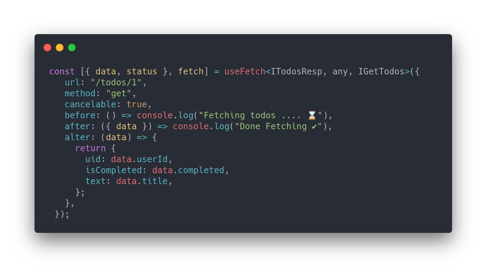

# use-fetch-lib 🔥

A simple React Hook that make rest api call easier\
Api calls without ~~Promise~~ or ~~async/ await~~

> **Note:** This is using the new [React Hooks API](https://reactjs.org/docs/hooks-intro.html)

## Install

```
$ npm i use-fetch-lib --save
$ yarn add use-fetch-lib
```



## ✨ It features:

- Simple and Lightweight
- TypeScript ready
- Support Data Mocking
- SSR support
- Request Cancellation on component unmount
- Request Caching (In-Memory cache)
- Local/Cache state mutation (update your data as you want)

## How to use

https://github.com/kiranbhalerao123/use-fetch-lib-example

use-fetch-lib exposes two named exports to us,

- UseFetchProvider
- useFetch

1️⃣ UseFetchProvider

- UseFetchProvider is just a React component that help the `useFetch` to configure it properly.
- Just wrap your parent component with `UseFetchProvider`
- pass it, baseUrl(string) and authorizationToken(string|Function)

```jsx
<UseFetchProvider
  baseUrl="http://dummy.restapiexample.com"
  authorizationToken={useSelector((store: any) => store.token)}
>
  <App />
</UseFetchProvider>
```

2️⃣ useFetch

```javascript
const [{ data, status }, recall, updateState] = useFetch({
  url: "/api/v1/employee/1",
  method: "get",
  shouldDispatch: true
});

alternate syntax ♦️
const [{ data, status }, recall] = useFetch("/api/v1/employee/1"); // note: Default value of `shouldDispatch` is false
```

- This will get called on componentDidMount as we pass `shouldDispatch` true
- it returns an array that we destruct as [{data, status}, recall]
- `data` is an object return from Your api call
- `status` active status of your api call, can be destruct as {isFulfilled, isPending, isRejected, isMocked, isCached, err}
- `recall` it is a function to recall your api as you want
- `updateState` is a function to update fetch state locally, it take callback function with preData as its arg.
  - ex. updateState((preData)=> updatedData)
- **Cache**
  - You can cache your api req. by providing `cache: true`
  ```javascript
  const [{ data: Posts, status }] = useFetch({
    url: "/posts",
    method: "get",
    cache: true,
  });
  ```
- **Typescript**

  - we can pass generic types to `useFetch`

  ```javascript
    const [{ data: Posts, status: { isFulfilled } }, postTodoService] = useFetch<IPostData, IPostTodo>({
      url: "/posts",
      method: "post"
    });
  ```

- useFetch Params 👇

| name               | Type                     | Default | Required | Description                                                                                                        |
| ------------------ | ------------------------ | ------- | -------- | ------------------------------------------------------------------------------------------------------------------ |
| url                | string                   |         | required | The request URL                                                                                                    |
| method             | string                   | get     | optional | The request method `'get', 'delete', 'post', 'put'`                                                                |
| mockData           | {}                       |         | optional | This is default data for typescript types and api mocking                                                          |
| shouldDispatch     | () => boolean or boolean | false   | optional | The conditions for auto run the service(on `componentDidMount`)                                                    |
| cancelable         | boolean                  | false   | optional | Should cancel Api request on Component unmount                                                                     |
| shouldUseAuthToken | boolean                  | true    | optional | if it is true it will send your authorizationToken with the request                                                |
| dependencies       | Array<any>               | true    | optional | This is dependencies array, if any of dependency get update them the service will re-call(on `componentDidUpdate`) |
| before             | () => void               |         | optional | This function will trigger before the api call triggers                                                            |
| after              | (state) => void          |         | optional | This function will trigger after the Api call                                                                      |
| alter              | (state) => newState      |         | optional | With this function you can alter the api response as you want                                                      |
| options            | {}                       |         | optional | The config options of Axios.js (https://goo.gl/UPLqaK)                                                             |
